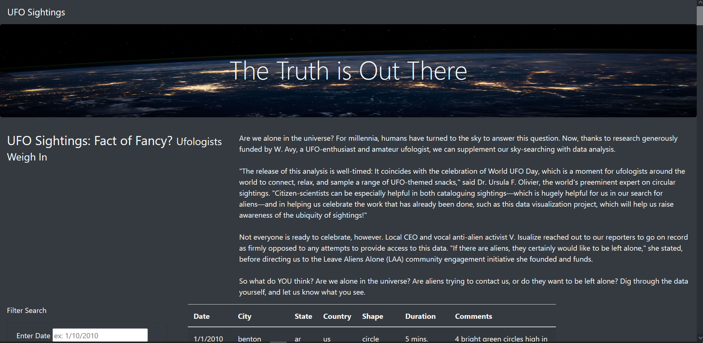
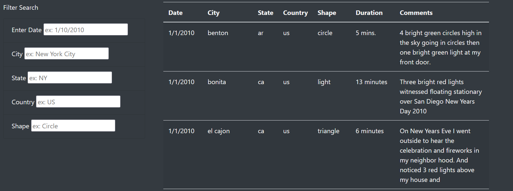
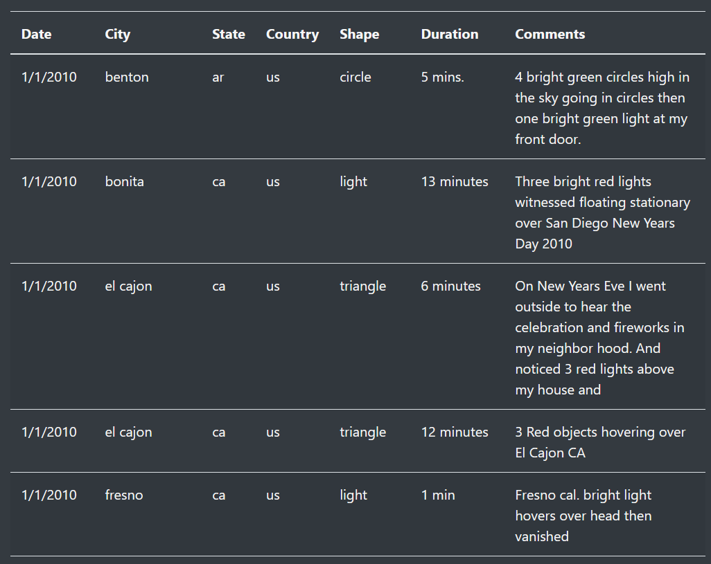
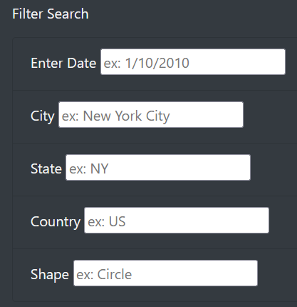
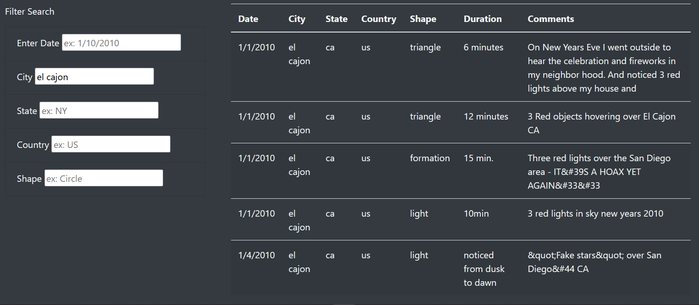
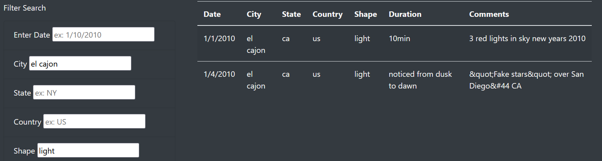

# UFO

## Overview
Given a dataset, we were tasked with creating a webpage that would allow the user to not only view the data, but also filter the data to show exactly what they are looking for.  

## Results

The process of working this website is relatively simple. When the website first loads, it will look like the following image. 

There is a title with a space background at the top, the title of the article on the left and the article on the right side. The article gives a quick explaination on UFOs and the data that is found below. Scrolling down further, you can see the filter on the left side of the screen and the UFO data on the right side. (see image below)

Taking a look at the data, it has been displayed in a table format with a header at the top describing the data in the column. The headers are data, city, state, country, shape (of the UFO), duration, and comments. 

The most important part of this webpage is on the left side titled 'Filter Search'. This allows the user to filter the UFO data to help narrow down the information. The user can filter based on Date, City, State, Country, and Shape. They can filter one of these, or they can filter based on multiple selections. 

An example of a simple search would be to search by city name. For example, type in 'el cajon' in the city filter text box and hit enter. This will filter the data based on the city El Cajon. Make sure to use lower case letters for all the searches or the filter will not work. As you can see in the image below, this returns all the UFO sightings from El Cajon, CA. 

To narrow down the searche results for El Cajon, you can also add a filter for 'light' that returns the UFO sightings that were lights in the sky. You could also filter by the date in the example. You could no filter by state or country since there is only one city in the data set named El Cajon so the state and country are the same for each row in the data. 

It is an option to filter by all 5 filtering options if you wanted to get specific. 

## Summary

Overall this website design is very effecting and allows the user to quickly and easily filter the data to find relavent information. There is one major drawback to the website as it is now. The data is out of date and also stagnate. The data is currenty a snapshot of data from the first two weeks of January 2010. A great improvement would be to have access to a live dataset that is constantly updated giving the user more responses and more current data as well. There are a few improvements that could be made to make this site even better and more helpful. The first improvement would be to make sure the filtering tool works with both lower case and capital letters. Right now the filter only works with lower case letters. If you type in a correct city name, but add upper case letters, it will not return anything. A second improvement would be add duration as a 6th filter option. This would allow the user to filter by the length of time the UFO was observed. 

